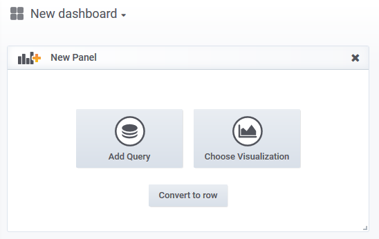
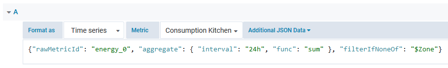

# Configure Grafana dashboard

## Prerequisites

* You have set up Grafana with an admin user and the datasource, see [here](configure_datasource.md).

## Create dashboard

Create a new dashboard in grafana and add a panel by clicking `Add Query`



You should see the query configuration, where you can add a new query. Select `Time series` as format and select your desired metric from the dropdown.

Each metric appears two times in the dropdown box: the first one will be a readable display name (e.g. *"Power Consumption Kitchen"**), the one just below each display name is the internal metric id (e.g. *"energy_0_power_consumption_a8fe..2d45"*).

The internal metric id is build in this pattern:

    <graph-viewmodel-id>_<index>_<metric-display-name>

And optionally with a metric id as suffix, if it exists (e.g. Digitalstrom zone id, meter id, etc.)

    <graph-viewmodel-id>_<index>_<metric-display-name>_<metric-id>

If you chose the display name from the dropdown box, you have to provide the internal metric id via `Additional JSON Data`:



The full schema of `Additional JSON Data` follows this pattern (all elements are optional):

```json
{
  "rawMetricId": "energy_0",
  "aggregate":
  {
    "interval": "1h",
    "func": "sum"
  },
  "correction":
  {
    "factor": 0.1
    "offset": 12.5
  },
  "filterIfNoneOf": [ "filter1", "filter2" ],
  "overrideMaxDataPoints": 100
}
```

### Detailled description

| Element | Description |
| --- | --- |
| `rawMetricId` | The internal metric id, at least the first two parts, i.e. `<graph-viewmodel-id>_<index>`. Values for `<graph-viewmodel-id>` are currently: `energy`, `sensors`, `heating`, `solar` and `solarenergy` |
| `aggregate.interval` | Aggregate into the given time resolution, e.g. `1d`, `5m`, `2h30m`, `1h15m30s`. |
| `aggregate.func` | Aggregate all values with the given function, allowed values are `min`, `max`, `avg` and `sum`. |
| `correction.factor` | Multiply all values by `factor`. |
| `correction.offset` | Add `offset` to all values. |
| `filterIfNoneOf` | Only show the requested metric if the internal metric id shows up in this `filterIfNoneOf` array. |
| `overrideMaxDataPoints` | Aggregate to a maximum resolution that results in no more than `overrideMaxDataPoints` number of data points. |

## Next steps

* [Add variables and annotations](configure_variables_annotations.md)
