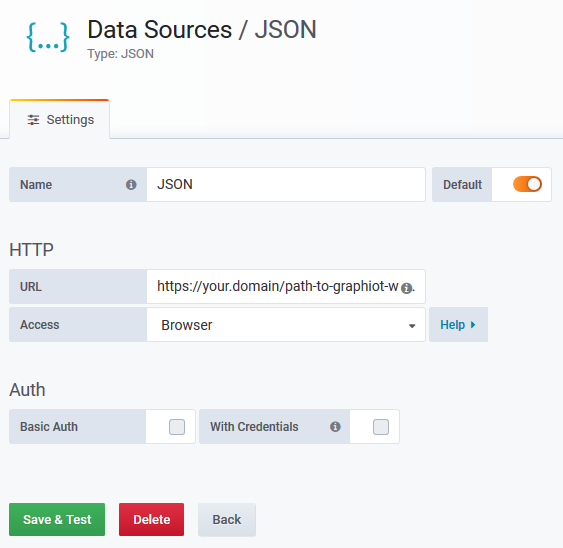

# Configure Grafana datasource

## Prerequisites

If you want to configure grafana in your *development* environment:

* You have set up your dev environment with Grafana, see [here](../setup/setup_development.md).

If you want to configure grafana in your *production* environment:

* You have set up your dev environment (see [here](../setup/setup_development.md)) **and** production environment with Grafana (see [here](../setup/setup_production.md)).

## Setup admin user

After you start the application and go to the grafana url in your browser, you should see the grafana login page.

Enter the initial magic credentials with username `admin` and password: `admin`. You should be promted to create a real admin user with a username and password of your choice.

## Create datasource

In the `Configuration` menu, go to `Data Sources`. Add a new datasource and select `JSON`.

If you do not have a `JSON` datasource, install the respective plugin from [here](https://grafana.com/grafana/plugins/simpod-json-datasource).

In the `JSON` datasource configuration panel, set the URL for dev to:

    http://localhost:53685/api/grafana

or for production to (replace your domain and website base path and append `/api/grafana`):

    https://your.domain/path-to-graphiot-website/api/grafana

and set the `Access` mode to `Browser`, as both grafana and the API run on the same website, to allow direct access.

It should look like follows:

Hit `Safe & Test` to make sure the datasource works.

## Next steps

* [Create a dashboard](configure_dashboard.md)
